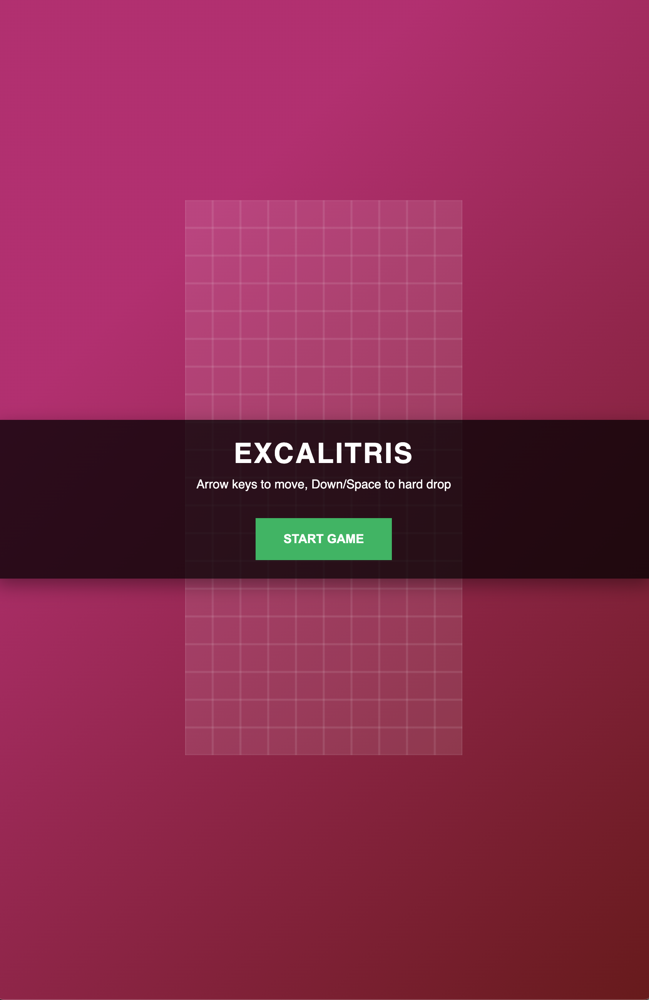
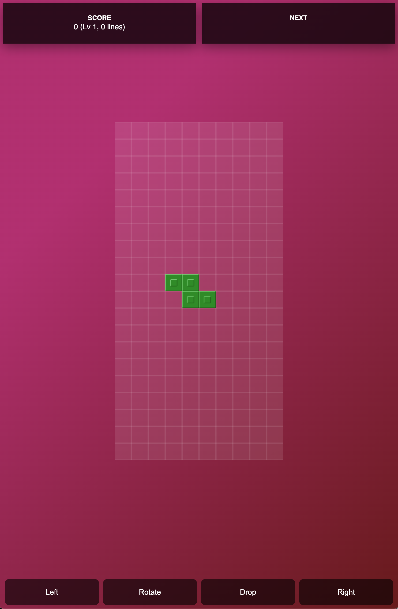

# Sample Tetris clone built in Excalibur

Play sample [here](https://chrisk-7777.github.io/excalitris/)

<table>
<tr>
<td>

</td>
<td>

</td>
</tr>
</table>

## Running locally

- Using [nodejs](https://nodejs.org/en/) and [npm](https://www.npmjs.com/)
- Run `npm install` to install dependencies
- Run `npm run start` to run the development server to test out changes

## Building bundles

- Run `npm run start` to produce javascript bundles for debugging in the `dist/` folder
- Run `npm run build` to produce javascript bundles for production (minified) in the `dist/` folder
